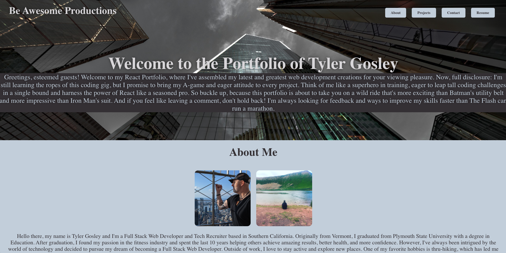
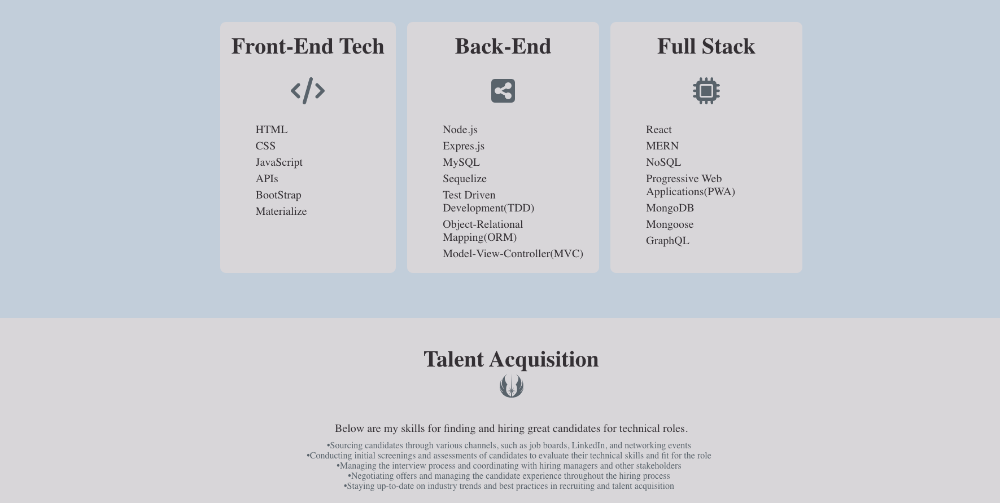

# React to the Future

## Description

---

Coming to the end of the UCLA extension Full Stack Development, I needed a place to showcase who I am, what I have learned, and what I have created. Welcome to my first React Portfolio.

## Table of Contents

- [Link](#link)
- [Installation](#installation)
- [Usage](#usage)
- [Screenshot](#screenshot)
- [Licenses](#licenses)
- [Contributing](#contributing)
- [Tests](#tests)
- [Questions](#questions)
- [Credits](#credits)

---

## Link

---

To view my React Profile, React to the Future, please click 👉 [Here](https://tygosley.github.io/react-to-the-future/)

## Installation

1. Clone the repository from GitHub
1. Install `node.js`
1. Run `npm install` to install dependencies
1. Run `npm start` to start the web server and connect

**Notable Dependencies**

- formspree/react: 2.4.1
- fortawesome/react-fontawesome
- dotenv

---

## Usage

Once everything is installed, simply use `npm start` in your root command line. This will connect and run your React application.

For the contact form I used formspree. To use this you must create an account on [formspree](https://formspree.io/).

---

## Screenshot

---

**Homepage**

**Projects Section**

**Resume Section**

## Licenses

---

      This project is covered under the MIT license. To learn more about what this means, click the license button at the top.

---

## Contributing

If you have any suggestions, please reach out!

## Tests

N/A

---

## Questions

Have questions about this project? Please reach out to me.

| GitHub Username             | Email              |
| --------------------------- | ------------------ |
| https://github.com/TyGosley | tygosley@gmail.com |

## Credits

---

[React](https://react.dev/)

[FormSpree](https://formspree.io/)

[dotenv](https://www.npmjs.com/package/dotenv)

[Font Awesome](https://fontawesome.com/icons)

[Node.JS](https://nodejs.org/en/docs)

[Express.JS](https://expressjs.com/en/guide/routing.html#express-router)

[Codecademy](https://www.codecademy.com/learn)

[Khan Academy](https://www.khanacademy.org/)

[MDN Docs](https://developer.mozilla.org/en-US/)

[W3Schools](https://www.w3schools.com/js/default.asp)

[JavaScript.info](https://javascript.info/)

[CodeHS](https://codehs.com/)
